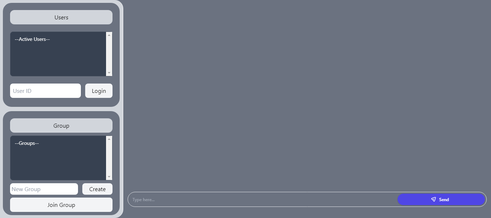
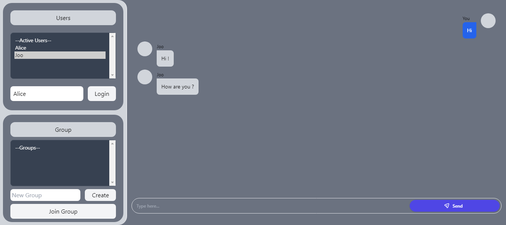
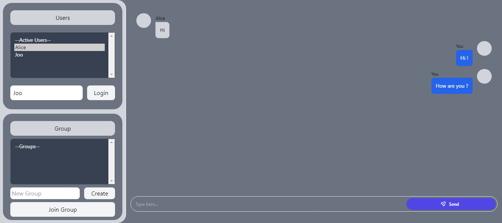

<p align="center">

  <h3 align="center">
    socket.io chat app
  </h3>

  <p align="center">
    private message | group message
  </p>
</p>

# Table Of Contents

- [About](#about)
- [Screenshot](#screenshot)
- [Quick Installation](#quick-installation)
  - [Install](#install)
  - [Development](#development)
- [License](#license)

# About

A basic level web socket protocol for private messaging between users and group messaging applications. Through this application, users can message each other live and through the groups they join.

# Screenshot

<div align="center">
  
  
  
</div>

# Quick Installation

### Install

```bash
$ pnpm install
```

### Development

```bash
$ pnpm dev
```

# License

Distributed under the Apache-2.0 License. See [LICENSE](./LICENSE) for more information.
